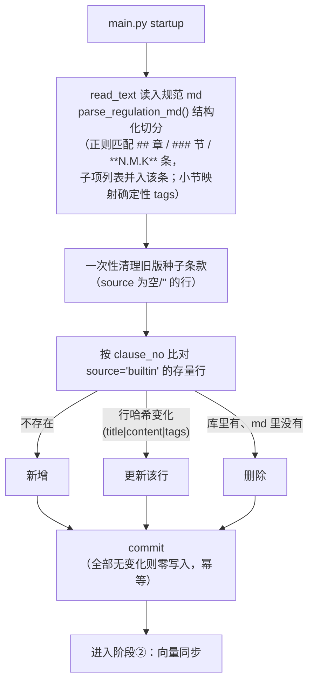
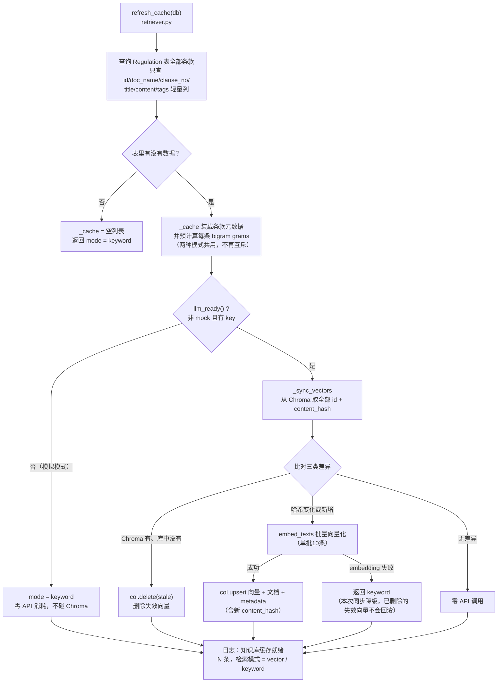
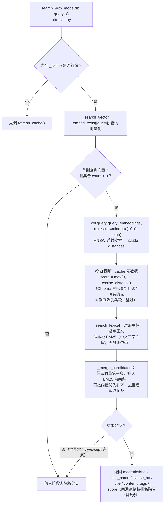
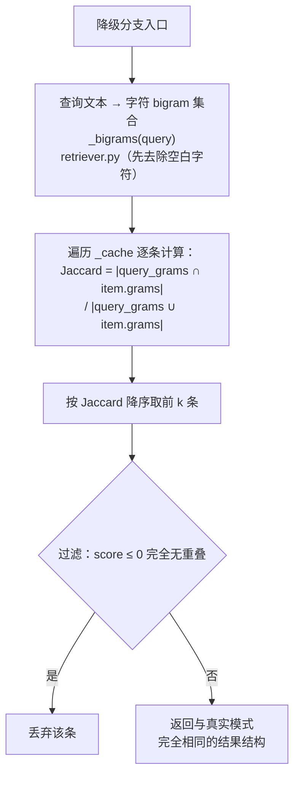
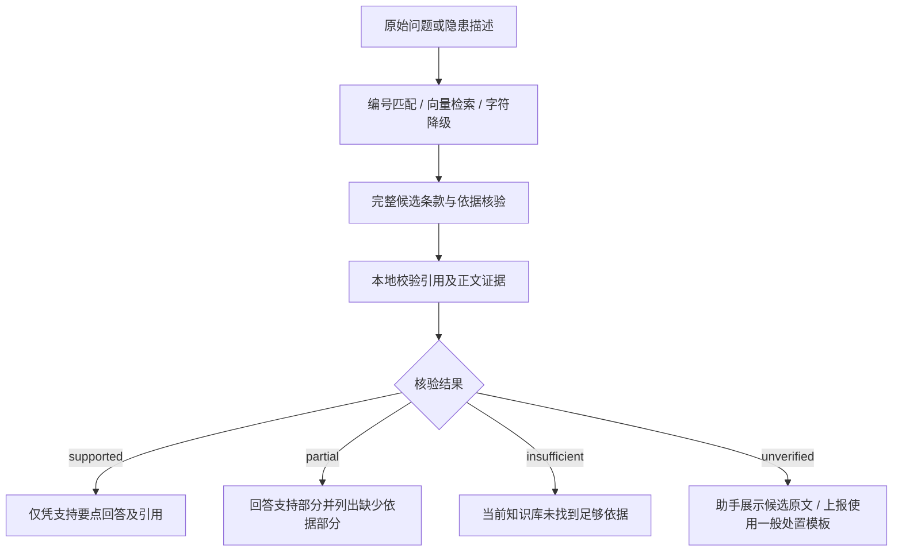

# RAG 检索实现分析

> 对应代码：`backend/app/rag/retriever.py`（检索核心）、`backend/app/services/knowledge.py`（知识入库）、`backend/app/agents/llm.py`（embedding 调用）、`backend/app/config.py`（模型配置）
>
> 一句话概括：**规范 Markdown 启动时切片入业务数据库（MySQL或SQLite），向量存入 Chroma 本地持久化库（`knowledge/chroma_data`），按条款内容哈希增量更新**——没有独立向量库服务，真实模式为向量+本地BM25混合召回，向量失败静默降级字符 bigram Jaccard，接口一致。

本文按链路拆分为 **4 个阶段** 分段讲解，每段配独立的 Mermaid 流程图。

---

## 1. 整体架构（文字版）

```
backend/knowledge/规范.md（原始文档层）
        │ services/knowledge.parse_regulation_md() 条款级切片
        ▼
业务库 Regulation 表（条款文本，source='builtin'）
        │ refresh_cache() 只查轻量文本列
        ▼
内存缓存 _cache（模块级列表）                Chroma 本地库（knowledge/chroma_data）
 每条：{id, doc_name, clause_no,              集合名 regulations_{embed_model}
        title, content, tags,                 向量 + metadata(content_hash)
        grams: set}  ◄────── 检索结果按 id 回填 ─────┐
                       │                            │
                       ▼                            │
            search(db, query, k) 相似度计算 ─────────┘
      真实模式：HNSW 近邻（cosine）+ 本地 BM25 混合召回｜降级模式：bigram Jaccard
```

| 组成部分 | 实现 | 位置 |
| --- | --- | --- |
| 原始文档 | BUILTIN_MD_FILE指向的仓库规范Markdown，一条（N.M.K）= 一个 chunk | `services/knowledge.py` |
| 条款存储 | MySQL/SQLite `Regulation` 表（`source='builtin'`，启动时幂等同步；`import` 预留给未来文档导入管线） | `models.py` |
| 向量模型 | 阿里云 DashScope `text-embedding-v4`（默认值，可运行时配置覆盖） | `config.py` |
| 向量存储 | Chroma 嵌入式客户端，持久化目录 `backend/knowledge/chroma_data/`，集合名带模型名 | `retriever.py` |
| 相似度计算 | 向量 HNSW 近邻 + 本地 BM25 混合召回（真实）/ 字符 bigram Jaccard（降级） | `retriever.py` |
| 调用方 | ① LangGraph `retrieve` 节点（k=4）；② 安全助手 `search_regulations` 工具及规则降级 `kb_answer`（k=3） | `agents/graph.py`、`agents/chat_agent.py`、`agents/chat_tools.py` |

---

## 2. 阶段①：知识入库（sync_builtin_knowledge）

内置规范以**仓库文件为原始文档层**，启动时切成条款同步进业务数据库，替代旧版种子 JSON 灌库：



设计要点：

- **结构化切分，非通用窗口切分**：chunk 边界就是条款编号边界，检索命中后能直接给出 `《doc_name》第N.M.K条` 的精确引用；
- **tags 是确定性映射**（章/小节号 → 检索标签），不是 LLM 生成，稳定且可重算；
- 本模块只管业务库条款行，**向量索引由阶段②按内容哈希派生**，两层职责分离。

---

## 3. 阶段②：缓存构建与向量同步（refresh_cache / _sync_vectors）

启动时（带 3 次重试）或首次 `search()` 触发。设计关键：**应用层获取embedding后写入Chroma磁盘目录，不再存入Regulation.embedding字段**；业务数据库只提供条款文本，内存 `_cache` 只保留元数据。



三个关键机制：

1. **逐条增量，不再全量重算**：每条向量携带自己的 `content_hash`（`id|doc_name|clause_no|title|content` 的 MD5，`retriever.py`）。改一条条款只重算这一条，其余向量留在磁盘上原样复用——对比旧版"整库一个 MD5、改一条全量重算"是本次重构的核心收益；
2. **集合名带模型名**（`regulations_text-embedding-v4`，`retriever.py`）：换 embedding 模型时自动落到新集合全量重建，新旧向量永不混算，旧集合目录留在原地可手动清理；
3. **删除同步**：库中删掉的条款，其向量在下次 `refresh_cache` 时被 `stale` 分支清掉，不留幽灵数据。

向量化调用细节（`embed_texts`，底层走 `agents/llm.py` 的 OpenAI 兼容客户端）：

- 模型：`text-embedding-v4`（`config.py` 默认，设置页可覆盖）；
- **每批最多 10 条**（模型单批上限），按 `resp.data[].index` 排序还原顺序；
- 返回 `None` 表示失败，由调用方决定降级。

落盘后的文件结构（`knowledge/chroma_data/`）：`chroma.sqlite3` 存元数据/文档/哈希，UUID 目录存 HNSW 向量索引（`data_level0.bin` 等），体积随条款数量与向量维度变化，可整体删除触发全量重建。

---

## 4. 阶段③：检索执行——真实模式（向量召回 + BM25 混合）

`search_with_mode(db, query, k)` 的真实分支：先取向量候选，再做本地 BM25 补召回并合并（`mode=hybrid`）；仅当向量有结果而关键词无候选时返回纯向量结果。



要点：

- **近似搜索交给 Chroma**，应用层不再自己写余弦循环；cosine distance → 相似度的换算只有一行（`1 - dist`）；
- **BM25 是补召回而非重排**：融合 score（两通道 `1/(60+rank)` 之和）仅用于诊断日志，实际顺序由通道配额（向量首位 → BM25 前两位 → 向量优先补齐）决定，不把不同检索器的原始分数互相比较，也不作为拒答门槛；
- 内存 `_cache` 是**详情的唯一出口**：Chroma 只回 id 和 distance，条款文本/标签从 `_cache` 按 id 取——向量库损坏也不影响结果拼装的 correctness（大不了整体降级）；
- `search_with_mode()` 外层还包了一层 try/except：Chroma 客户端异常同样静默落进关键词模式，**降级链共三层**（llm 未就绪 → 同步失败 → 检索失败/空结果）；
- 返回结构是干净的 dict 列表，调用方（工单草稿的 `regulation_refs`、对话回答的 `refs`）直接可用。

---

## 5. 阶段④：检索执行——降级模式（bigram Jaccard）

模拟模式或向量调用失败时的兜底，**零 API 消耗、零外部依赖**：



bigram 即相邻两字滑动窗口（如"消防通道" → `{消防,防通,通道}`），对中文短文本的召回效果尚可；集合交并比就是 Jaccard 相似度。与旧版不同，**grams 现在无条件预计算**（阶段②的 `_cache` 装载时统一算好），不再和向量互斥——这样向量化中途失败时可以无缝切到关键词模式，无需回填。阈值刻意放得很松（只剔除零重叠），避免全文长条款被阈值误伤。这个模式保证了**断网 / 无 key 演示场景下全链路依然可用**。

---

## 6. 两个调用方

| 调用方 | 参数 | 用途 |
| --- | --- | --- |
| LangGraph `retrieve` 节点（`agents/graph.py`） | `search(db, raw_text, k=4)` | 原始上报文本检索规范条款，作为处置建议的引用依据；风险定级底线来自RISK_FLOOR规则（工单草稿取最多前 4 条进 `regulation_refs`） |
| 安全助手 `search_regulations` 工具及规则降级 `kb_answer`（`agents/chat_agent.py`、`agents/chat_tools.py`） | `search(db, msg, k=3)` | 用户提问检索条款：LLM 可用时作为上下文生成带出处的回答；不可用时直接拼接条款原文返回 |

两处拿到的是同一个接口、同一种返回结构——`search()` 的签名就是这个 RAG 层对外的全部抽象面。

---

## 7. 现状评估

### 7.1 合理之处

1. **增量更新**：逐条 `content_hash` 比对，改一条只重算一条；条款无变动时重启**零 embedding 调用**，向量直接从磁盘复用。
2. **向量持久化**：Chroma `PersistentClient` 落盘，向量有了单一事实源（不再有"表字段 + 缓存文件"两份向量各存一份的二义性），`Regulation.embedding` 字段已闲置退役。
3. **模型隔离**：集合名含 embedding 模型名，换模型自动新集合全量重建，不会新旧向量混算。
4. **混合召回 + 三层降级**：真实模式向量叠加本地 BM25 补召回，无新增分词依赖；llm 未就绪、同步失败、检索异常均静默落关键词，各模式返回结构一致，演示场景零外部依赖。
5. **结构化切分**：一条条款即一个 chunk，命中即可给出精确条文引用，答辩可讲可验证。

### 7.2 局限（升级动因）

1. **嵌入式单进程**：Chroma 以库形态嵌在后端进程里，不支持多实例共享同一目录（当前本地目录部署按单服务实例使用，共享部署需另行设计）；数据规模或并发上来后需迁移 Chroma Server 或独立向量库。
2. **一致性依赖启动同步**：向量与业务库条款行的一致性由 `refresh_cache` 时刻保证，运行期若直接改库（如未来文档导入接口），需记得触发刷新，否则新增条款在本次进程生命周期内检索不到。
3. **HNSW 图不便于人工审计**：`chroma_data` 下是二进制索引文件，排查问题需借助 Chroma API 或打开 `chroma.sqlite3` 查元数据表。
4. **无重排序（rerank）**：向量召回直接按距离截断，未做交叉编码精排；k 较小时语义相近但编号不同的条款可能挤占名额——百条级规模下影响有限。

### 7.3 演进路径

```
Chroma 本地嵌入式（现状）
  → Chroma Server / Qdrant / Milvus   ← 需要共享向量库或上量时：search() 接口不变，只换 retriever 内部
  → + rerank 精排                     ← 召回质量优化，qwen 有 gte-rerank 可选
  → 文档导入管线（source='import'）    ← 上传任意规范 md/pdf 走同一套"切片→入库→增量向量化"链路
```

每一步都只动 `rag/retriever.py`（或新增 service）——`search(db, query, k) -> list[dict]` 依然是干净的抽象边界，这也是当前实现最重要的资产。

## 8. 当前代码边界

当前仅同步BUILTIN_MD_FILE指向的规范文件，不会扫描并导入目录内任意Markdown。旧版49条种子条款在首次同步时清理，当前数量以parse_regulation_md输出为准。`search` 对空白查询直接返回空结果；明确指定三段条款编号时先精确匹配，不存在的编号不回退相似条款；其他查询先尝试向量化，失败或无结果再走关键词。refresh_cache返回的mode不是固定的后续检索开关。模拟模式不调用embedding API，但chromadb仍为必装依赖，因为模块顶层直接导入。

安全助手真实模式由模型选择 reply_directly、ask_clarification 或业务工具，需要规范依据时通过 search_regulations 调用 RAG。已移除首轮没有工具就强制检索的兜底；规则降级也不再默认知识库，而是在明确规范问题时调用 kb_response。项目管理助手不使用规范检索工具。详见 [RAG路由优化说明](RAG路由优化说明.md)。当前正常检索已加入本地 BM25 补召回，见 [安全帽召回优化](RAG安全帽召回优化.md)；未实现模型 rerank 或通用文件上传入库。

## 9. 轻量优化与评测（2026-10-02）

- 上报检索启用 `build_report_query`：删除抽取结果明确匹配的楼栋、楼层，前置隐患类型；保留原文中的部位、数字和否定事实。不额外调用 LLM。该开关依据真实向量评测启用，可以在 `graph.py` 中关闭以恢复原始查询。第 6 节的 `raw_text` 调用表描述的是原始基线。
- 支持 `3.2.3` / `第3.2.3条`，多个编号按出现顺序去重，匹配同编号的记录按 ID 排序。精确匹配的 `score=1.0` 表示编号命中，不是 cosine 相似度。
- 处置建议继续使用前三条，但不再截取每条前 80 字；规范名、编号、标题和完整正文共用 8,000 字符预算，超预算跳过完整条款并记日志，不截断正文。工单最多保留四条引用。
- 对外 `search(db, query, k) -> list[dict]` 不变；内部 `search_with_mode` 额外返回 `exact/hybrid/vector/keyword/empty`，用于评测真实执行路径。
- 40 条固定样例覆盖上报 20 条、问答 10 条、编号 5 条、知识库外问题 5 条。评测使用内存 SQLite、独立临时 Chroma 目录，阻止业务数据库导入连接，不使用设置页配置。向量配置取环境变量或 `.env`；实际发生降级时不能通过真实模式验收。
- [评测报告](RAG轻量优化评测报告.md) 包含结果、边界及下一阶段候选；[逐条结果](RAG轻量优化评测.json) 保存语料哈希、实际模式、耗时和 Top-10 诊断。未加入混合检索、rerank 或未经校准的相似度门槛。

## 10. 相关性与依据核验（2026-10-02）

检索后的条款先作为候选，启用 `RAG_EVIDENCE_CHECK_ENABLED` 后才进入共享 `rag/evidence.py` 核验。安全助手仍召回三条，上报四条；候选的规范名、编号、标题及完整正文共用8,000字符预算，超预算整条跳过。检索相似度只负责排序，编号命中的1.0也不能证明条款支持用户结论。底层 `search()` 返回字段未改变。



核验使用当前文本模型，一次检索最多调用一次，超时20秒且不重试；JSON、候选ID、证据正文摘录必须通过本地校验。服务失败、模拟模式、非法引用或摘录都返回 `unverified`，确认引用为空。服务失败不表示规范没有规定。纯粹查询指定编号原文的完整匹配请求可直接展示，解释、适用性或复合问题仍须核验。

助手核验接收当前用户原话、单独的检索query及最近两轮历史（最多4,000字符），历史只用于指代。Agent和规则降级共用核验结果；工具前隐藏未经核验的规范结论，仅显示进度。原有SSE事件不变，规范卡片新增可选 `status/notice/candidates`；失败候选卡标题为“候选条款”，展开显示完整原文，旧卡片继续显示。

上报核验使用原始隐患描述。仅通过的条款进入建议生成和工单引用；部分支持附缺少依据提示，生成失败时明确列出核验要点。依据不足或无法核验仍生成待审核草稿，使用现有一般处置模板，引用为空并标明“规范依据待人工核实”。风险底线、责任匹配、期限和审核流程沿用现有逻辑。核验开启时建议上下文最多四条已接受条款；关闭时第9节的前三条逻辑保留。

80条独立问答及12条上报案例位于 `backend/tests/fixtures/relevance_cases.py`。开发集和验收集各40条、每类10条，问题族不跨集合。标签仅用于本地评分，不发送给模型，也不在线检索。评测仍隔离业务数据库和向量目录；真实结果、复核方式、开关状态及复现命令见 [依据核验评测报告](RAG依据核验评测报告.md)。尚未进行领域专家复核，模型判断与后续生成都仍可能出错。
