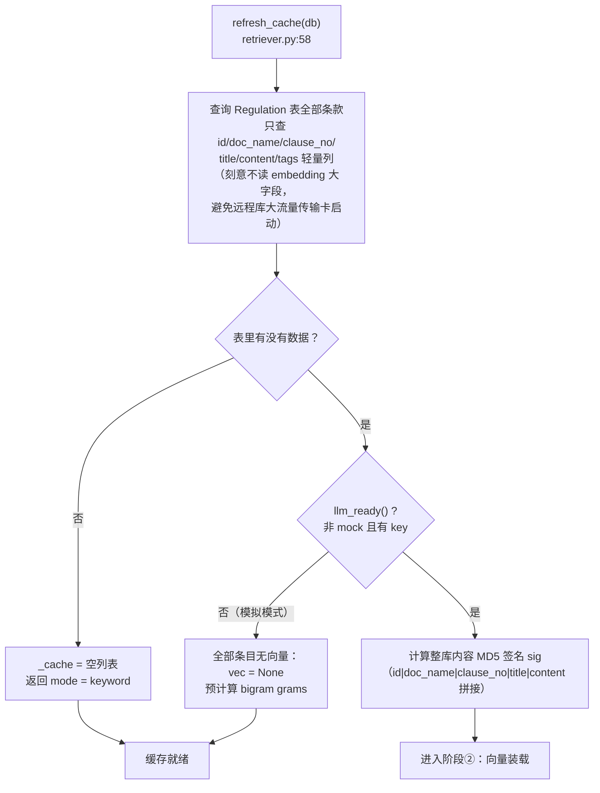
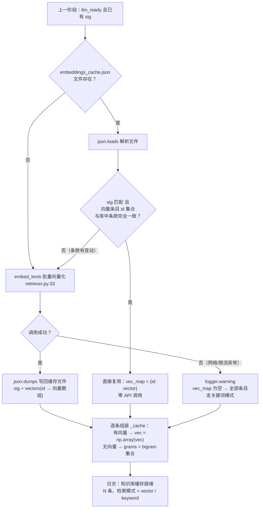
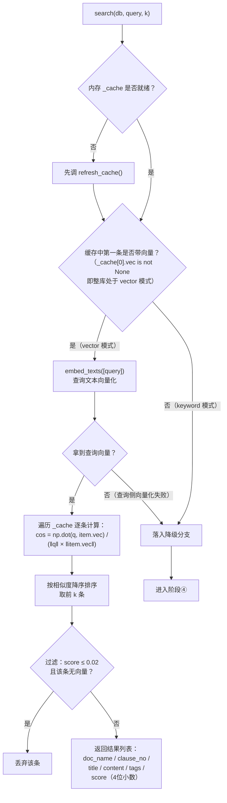
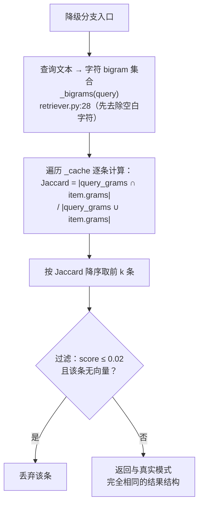

# RAG 检索实现分析

> 对应代码：`backend/app/rag/retriever.py`（核心）、`backend/app/agents/llm.py`（embedding 调用）、`backend/app/config.py`（模型配置）
>
> 一句话概括：**条款存 MySQL、向量缓存在本地 JSON 文件、相似度计算在进程内用 numpy 暴力算**——没有独立向量库服务，双模式（向量 / 关键词）接口一致，可静默降级。

本文按链路拆分为 **4 个阶段** 分段讲解，每段配独立的 Mermaid 流程图。

---

## 1. 整体架构（文字版）

```
MySQL Regulation 表（条款文本）          embeddings_cache.json（向量缓存）
        │ 只查轻量列，不读 embedding 大字段        │ json.loads
        └──────────────┬──────────────────────────┘
                       ▼
            内存缓存 _cache（模块级列表）
         每条：{id, doc_name, clause_no, title,
                content, tags, vec: np.ndarray, grams: set}
                       │
                       ▼
            search(db, query, k) 相似度计算
         真实模式：numpy 余弦暴力算｜降级模式：bigram Jaccard
```

| 组成部分 | 实现 | 位置 |
| --- | --- | --- |
| 条款存储 | MySQL `Regulation` 表（种子数据来自 `knowledge/regulations.json` 灌库） | `models.py:246` |
| 向量模型 | 阿里云 DashScope `text-embedding-v4`（默认值，可运行时配置覆盖） | `config.py:21` |
| 向量缓存 | 本地 JSON 文件 `backend/app/knowledge/embeddings_cache.json`，整库 MD5 签名校验 | `retriever.py:25,51` |
| 相似度计算 | 进程内 numpy 余弦（真实）/ 字符 bigram Jaccard（降级） | `retriever.py:119` |
| 调用方 | ① LangGraph `retrieve` 节点（k=4）；② AI 对话 `kb` 意图（k=3） | `agents/graph.py`、`routers/chat.py` |

---

## 2. 阶段①：缓存构建（refresh_cache）

首次 `search()` 或启动时触发，把条款和向量装载进内存。设计关键：**MySQL 只取文本，向量从本地 JSON 文件来**，两者在内存里拼合。



装载完成后，每条条款在 `_cache` 中是这样一个 dict：

| 字段 | 说明 |
| --- | --- |
| `vec` | `np.ndarray(float32)`，有向量时非空 |
| `grams` | 字符 bigram 集合，**仅在无向量时预计算**（`vec is None` 才算，二者互斥） |
| 其余 | doc_name / clause_no / title / content / tags 原样保留 |

---

## 3. 阶段②：向量装载与缓存文件读写

这是"JSON 解析"发生的地方。缓存文件按**整库签名**校验：条款内容没变就直接复用，变过就全量重算重写。



向量化调用细节（`embed_texts`，底层走 `agents/llm.py` 的 OpenAI 兼容客户端）：

- 模型：`text-embedding-v4`（`config.py:21` 默认，设置页可覆盖）；
- **每批最多 10 条**（模型单批上限），按 `resp.data[].index` 排序还原顺序；
- 返回 `None` 表示失败，由调用方决定降级。

**当前方案的代价**：签名是"整库一个 MD5"——哪怕只改一个条款，签名失配就触发**全量重算 + 全量重写**缓存文件，条款多时首次启动要付一笔 embedding 费用和等待时间。

---

## 4. 阶段③：检索执行——真实模式（向量余弦）

`search(db, query, k)` 的向量分支，纯进程内计算：



要点：

- 相似度是**逐条暴力算**（Python 循环 + numpy 点积），百条级规模下耗时可忽略；
- 模式判定取 `_cache[0]["vec"]` 是否为空——整库要么全有向量、要么全无，不存在混合模式；
- 返回结构是干净的 dict 列表，调用方（工单草稿的 `regulation_refs`、对话回答的 `refs`）直接可用。

---

## 5. 阶段④：检索执行——降级模式（bigram Jaccard）

模拟模式或向量调用失败时的兜底，**零 API 消耗、零外部依赖**：



bigram 即相邻两字滑动窗口（如"消防通道" → `{消防,防通,通道}`），对中文短文本的召回效果尚可；集合交并比就是 Jaccard 相似度。这个模式保证了**断网 / 无 key 演示场景下全链路依然可用**。

---

## 6. 两个调用方

| 调用方 | 参数 | 用途 |
| --- | --- | --- |
| LangGraph `retrieve` 节点（`agents/graph.py:51`） | `search(db, raw_text, k=4)` | 原始上报文本检索规范条款，作为风险定级底线和处置建议的引用依据（工单草稿取前 4 条进 `regulation_refs`） |
| AI 对话 `kb` 意图（`routers/chat.py:95`） | `search(db, msg, k=3)` | 用户提问检索条款：LLM 可用时作为上下文生成带出处的回答；不可用时直接拼接条款原文返回 |

两处拿到的是同一个接口、同一种返回结构——`search()` 的签名就是这个 RAG 层对外的全部抽象面。

---

## 7. 现状评估

### 7.1 合理之处

1. **规模匹配**：条款只有百条级，内存暴力算余弦微秒级完成，独立向量库（Milvus/Chroma）在这个量级纯属过度设计——代码注释也明确了这一取舍。
2. **双模式同构**：向量 / 关键词两条路径返回结构完全一致，上游无感知，演示场景零外部依赖。
3. **启动流量可控**：MySQL 只查轻量列，向量走本地文件，避免远程库大字段传输。

### 7.2 局限（升级动因）

1. **全量失效**：整库单一 MD5 签名——改一条条款 = 全量重算全部向量 + 全量重写缓存文件。
2. **无事务保障**：`json.dumps` 写文件不是原子操作，写入中途失败可能损坏缓存（代码里 try/except 只是"不影响运行"，损坏后下次启动重新全量计算）。
3. **向量无单一事实源**：`Regulation.embedding` 字段（JSON 数组，`models.py:255`）与缓存文件各存一份语义相同的向量，前者目前闲置，存在认知上的二义性。
4. **无元数据可查询性**：JSON 文件只能整体读，无法按条款单独查询、更新或审计。

### 7.3 建议的演进路径

```
JSON 文件缓存（现状）
  → SQLite BLOB + numpy 暴力检索   ← 下一步：逐条 content_hash 增量更新、事务写入、零新依赖
  → sqlite-vec（SQL 内 KNN）        ← 可选，规模到十万级再考虑
  → Milvus / Chroma                 ← 独立向量库，search() 接口不变，只换 retriever 内部
```

每一步都只动 `rag/retriever.py` 一个文件——`search(db, query, k) -> list[dict]` 已经是干净的抽象边界，这也是当前实现最重要的资产。
