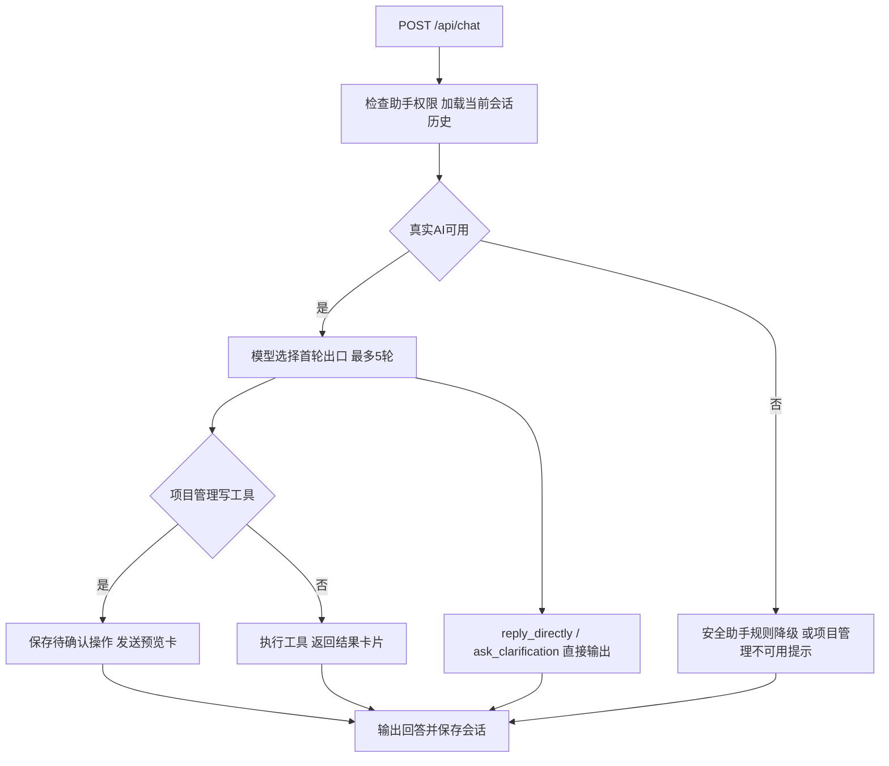

# 智能助手与聊天工作区说明

> 更新日期：2026-10-02。对应 `backend/app/agents/chat_agent.py`、`chat_tools.py`、`pm_tools.py`、`backend/app/rag/evidence.py`、`backend/app/routers/chat.py`、`frontend/src/views/Chat.vue` 和 `components/ChatArtifact.vue`。

安全助手和项目管理助手共用聊天工作区，通过助手标识选择提示词、工具集和会话历史。隐患上报使用LangGraph流水线，对话则使用独立的通义千问tool-calling循环。

## 1. 助手与工具

| 助手 | 页面 | 请求标识 | 工具数量 | 权限 |
| --- | --- | --- | --- | --- |
| AI安全助手 | `/chat` | `safety` | 9 | 四角色可访问，部分工具另有限制 |
| 项目管理助手 | `/pm-chat` | `pm` | 11 | 仅项目经理 |

安全助手工具如下：

| 工具 | 功能 | 角色限制 |
| --- | --- | --- |
| `query_order_progress` | 按工单号或楼栋、楼层查询进度 | 无额外角色白名单 |
| `list_orders` | 按状态、等级、关键词或本人责任筛选，最多8条 | 无额外角色白名单 |
| `query_stats` | 状态、风险、类型Top6、近8周趋势与超期数据 | 无额外角色白名单 |
| `search_regulations` | 检索规范，最多3条 | 无额外角色白名单 |
| `generate_weekly_report` | 生成并保存指定周周报 | 安全员、安全总监、项目经理 |
| `list_weekly_reports` | 最近10篇历史周报 | 同上 |
| `get_weekly_report` | 按周偏移获取周报全文 | 同上 |
| `query_site_directory` | 区域、分包、负责人目录 | 无额外角色白名单 |
| `submit_hazard_report` | 明确要求上报时生成待审核工单 | 安全员、安全总监 |

筛选工单列表会将分包责任人的结果限制为本人负责的工单；无额外角色白名单不代表所有工具都只返回本人数据，其他查询的数据范围需结合执行体核对。当前项目上下文也不等于完整的项目成员授权体系。

项目管理助手包含4个查询工具：`list_projects`、`list_zones`、`list_subcontractors`、`list_responsible_users`；7个写工具：`create_project`、`update_project`、`create_zone`、`update_zone`、`delete_zone`、`create_subcontractor`、`update_subcontractor`。目前没有删除项目、删除分包或创建负责人账号的助手工具。部分工具允许明确指定其他项目编号。

## 2. 意图路由、执行与降级

真实模式下，用户消息与历史先进入 Agent 模型，由模型选择首轮出口：业务工具、规范检索，或两个对话终端工具 `reply_directly`（普通交流直接输出文本）与 `ask_clarification`（信息不足时追问）。已取消"首轮未调用工具就强制检索规范"的兜底；规范问题的数字、适用性与合规判断仍要求检索并核验。终端工具不追加生成调用，也不发送工具进度或规范卡片。该路由只接入安全助手，项目管理助手保持原协议。

工具结果回送模型供后续回答，长周报用 `Terminal` 直接输出。实现先收集一轮上游流的文本和工具参数，再发送本轮 `delta`，不保证每个模型token到达时立即显示。

模拟模式、无key或Agent首轮失败时，安全助手走规则降级：完整匹配基本交流与致谢，明确业务问题分流到进度、统计、规范问答和本周周报，其余请求提示补充具体对象和需求，不再默认转向知识库。规范问答在核验开启时直接渲染核验要点或候选原文，不再追加一次可能绕过拒答的生成。项目管理助手无规则执行链，AI不可用时提示使用项目管理页面。已经输出内容后的模型中断返回 `error`。

## 2.1 依据核验

安全助手的规范回答与隐患上报共用 `rag/evidence.py` 的核验链路，由 `RAG_EVIDENCE_CHECK_ENABLED` 控制（示例配置默认关闭）。开启后对候选条款逐条校验支持要点与逐字证据摘录，产出四种内部状态：

| 状态 | 含义 | 安全助手行为 |
| --- | --- | --- |
| `supported` | 所有子问题有依据 | 只回答已支持要点，逐条附条款出处 |
| `partial` | 部分有依据 | 只回答已支持部分，逐项列出缺少依据的子问题 |
| `insufficient` | 全部无依据 | 返回明确提示，不生成规范结论 |
| `unverified` | 核验模型不可用/超时/超上下文预算 | 展示候选条款原文，不视为规范不存在 |

核验判断调用设置20秒时限且不自动重试；`clause_refs` 卡片扩展了可选的 `status`、`notice` 与 `candidates`（含正文）字段，兼容既有SSE与历史卡片。隐患上报始终生成待审核工单，无有效依据时引用为空并在处置建议中注明待人工核实。

## 3. SSE与业务卡片

POST接口返回 `StreamingResponse`，事件格式为 `data: <JSON>` 加空行。

| 事件 | 主要字段 | 作用 |
| --- | --- | --- |
| `tool` | `name`、`label`、`args` | 工具执行状态 |
| `delta` | `text` | 回答正文 |
| `artifact` | `artifact.type/title/data` | 业务结果卡片 |
| `refs` | `refs` | 规范引用 |
| `done` | `session_id`、`weekly_id` | 完成与编号回填 |
| `error` | `message` | 中断提示 |

卡片类型为 `work_order_list`、`stats_summary`、`clause_refs`、`weekly_report`、`hazard_submitted`、`directory_result`、`change_preview`，提供工单跳转、周报入口和字段确认等动作。正文仍通过 `delta` 传输。

## 4. 项目管理写操作确认

Agent选择写工具时，先保存 `chat_pending_actions` 并返回预览卡，不直接修改业务数据。用户点击确认或取消按钮后，调用 `POST /api/chat/actions/{token}` 并提交 `confirm`。

- token绑定用户及发起时的项目，默认10分钟过期。
- 确认入口检查归属、状态、有效期与角色，通过原子认领防止重复执行。
- 取消记录为 `cancelled`，不执行业务写入；超期记录为 `expired`。
- 确认后执行校验与写入，返回 `completed` 或业务错误 `failed`，并更新历史消息中的卡片。
- 有关联工单的责任区域不能删除，重复名称等校验由执行体处理。

自然语言中的“确认”不能消费已有token。该机制针对项目管理助手的七个写工具；安全助手的对话上报直接生成待审核草稿，派单仍需人工审核。REST与对话上报共用 `services/reporting.py:create_report_with_draft`。

## 5. 会话与接口

| 接口 | 用途 |
| --- | --- |
| `POST /api/chat` | 对话，传入message、assistant及可选session_id |
| `GET /api/chat/sessions` | 当前用户、项目、助手的会话列表 |
| `GET /api/chat/sessions/{session_id}/messages` | 恢复消息、轨迹与卡片 |
| `DELETE /api/chat/sessions/{session_id}` | 删除会话与消息 |
| `GET /api/chat/sessions/{session_id}/export` | 导出JSONL |
| `POST /api/chat/actions/{token}` | 确认或取消写操作 |

会话首次发送时惰性创建，标题取首条消息前20字。会话列表默认20条、最多50条，恢复最多最近50条消息；模型上下文为最近10条非空消息，每条截断至500字。恢复与导出检查用户和项目归属，聊天续聊还检查助手标识，不匹配则新建会话。

`chat_messages` 保存正文、引用、工具轨迹、卡片和周报编号。JSONL导出目前不包含 `artifacts`，不能作为完整确认卡恢复文件。确认结果会更新消息卡片，因此记录不是严格不可变日志。

## 6. 工作区与验证

桌面端支持可收起的历史栏、任务入口、复制、重试和停止生成；手机端通过抽屉查看历史。Enter发送，Shift + Enter换行。切换助手或项目后加载对应会话。停止生成会中止前端请求，不能撤销已执行操作。

现有 `backend/tests/` 使用内存SQLite覆盖：聊天协议（确认执行一次、重复确认拒绝、取消不执行和历史卡片回写，`test_chat_protocol.py`）、意图路由与规则降级（`test_chat_routing.py`）、依据核验校验与渲染（`test_evidence.py`）和检索合并（`test_rag.py`）。token归属、过期、角色限制及远程模型效果仍需补充验证；真实路由评测受连接及外发授权限制尚未完成，运行方式见README。
