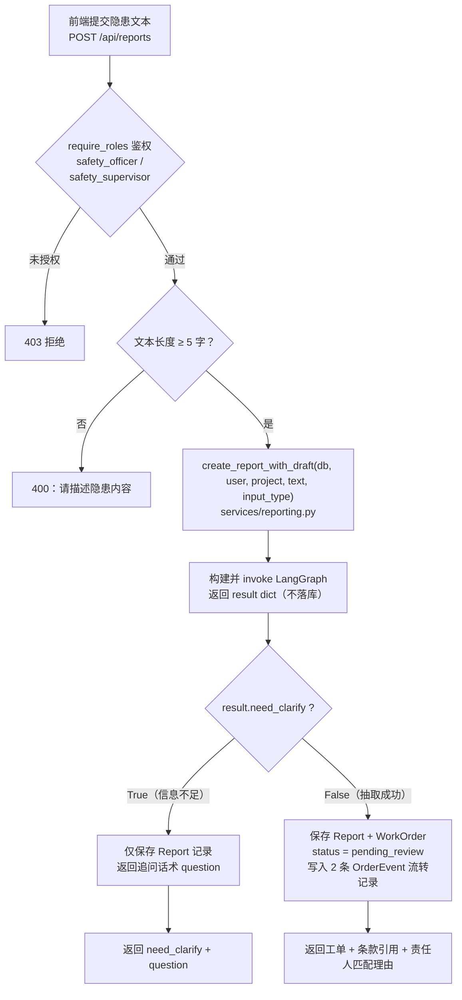
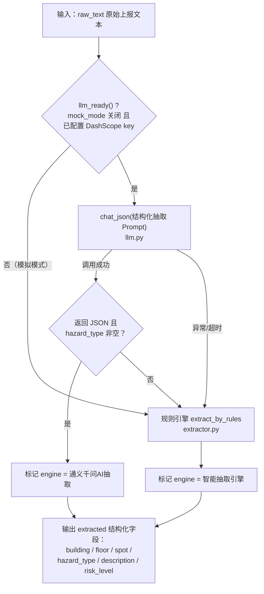
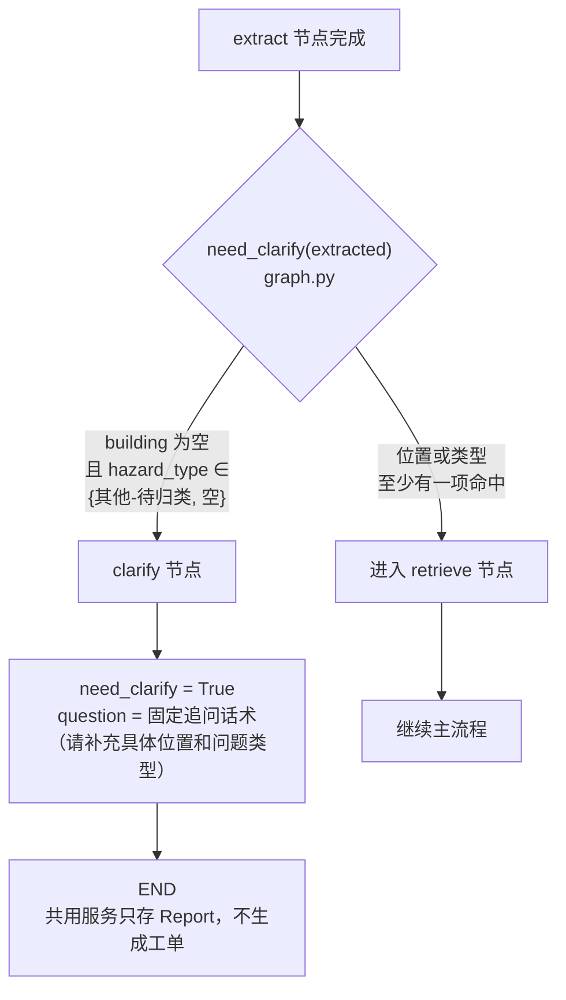
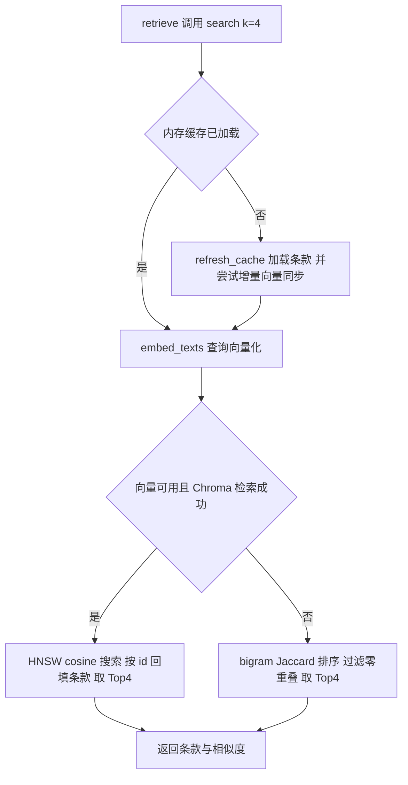
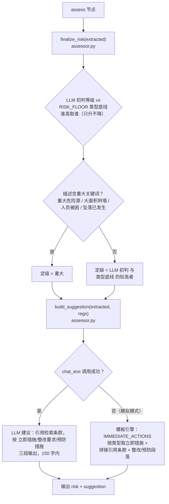
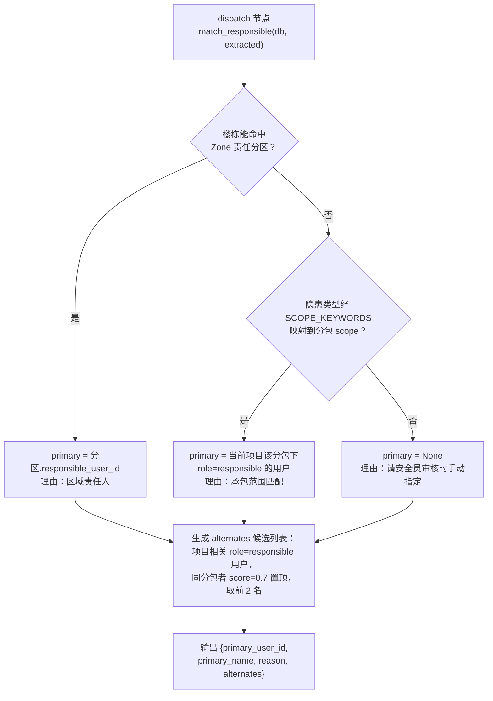
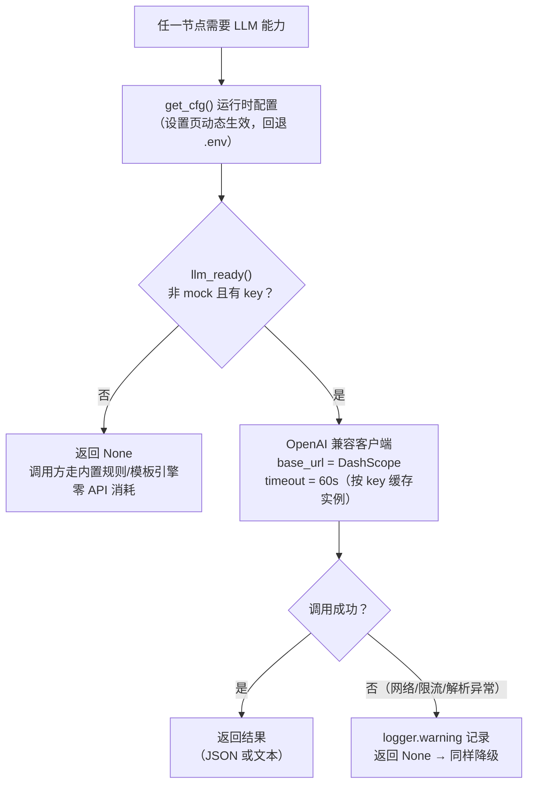
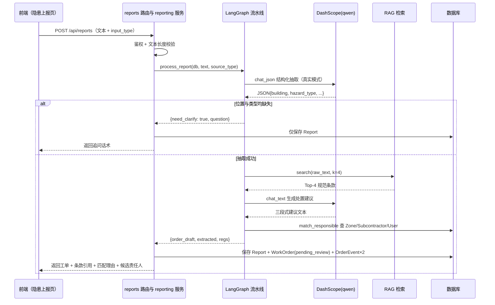

# 隐患上报 Agent 主链路说明

> 对应代码：`backend/app/agents/`、`backend/app/routers/reports.py`、`backend/app/rag/retriever.py`
>
> 主链路一句话概括：**安全员上报隐患文本 → 路由层鉴权 → LangGraph 状态机编排（信息抽取 → 追问/知识检索 → 风险定级 → 责任匹配 → 工单草稿）→ 共用上报服务落库生成待审核工单**。

本文将主链路拆分为 **5 个阶段** 分段讲解，每段配独立的 Mermaid 流程图，避免一张大图难以阅读。

---

## 0. 链路总览（文字版）

| 阶段 | 入口/节点 | 代码位置 | 职责 |
| --- | --- | --- | --- |
| ① 接入层 | `POST /api/reports` | `routers/reports.py`、`services/reporting.py` | 路由鉴权、校验；共用服务调用流水线并落库 |
| ② 信息抽取 | `extract` 节点 | `agents/extractor.py` | 原始文本 → 结构化隐患信息（LLM 优先，规则兜底） |
| ③ 路由分支 | 条件边 | `agents/graph.py` | 位置+类型缺失 → 追问结束；否则进入检索 |
| ④ 检索与定级 | `retrieve` + `assess` 节点 | `rag/retriever.py`、`agents/assessor.py` | 检索规范条款；风险定级并生成处置建议 |
| ⑤ 派单与草稿 | `dispatch` + `draft` 节点 | `agents/dispatcher.py`、`agents/graph.py` | 匹配责任人；组装工单草稿，由共用上报服务持久化 |

状态机定义在 `agents/graph.py` 的 `PipelineState`（TypedDict），各节点只读写状态字典，节点可独立替换（规则引擎 / LLM 引擎）。

---

## 1. 阶段①：接入层（路由 → 流水线入口）

REST路由负责鉴权和输入校验，随后调用 `services/reporting.py:create_report_with_draft`，由共用服务运行流水线并持久化。对话工具 `submit_hazard_report` 复用同一服务；流水线本身不落库，只返回 dict。

要点：

- 工单编号在共用上报服务生成（`services/reporting.py:gen_order_no`，格式 `ZA-YYYYMMDD-NNN`）。
- 流转记录由人工与 AI 各一条：安全员「上报隐患」+「筑安云AI 生成工单草稿」（含抽取引擎、条款数、匹配理由）。
- 楼栋能命中 `Zone` 分区时同时回填 `zone_id`。

---

## 2. 阶段②：信息抽取节点（extract）

`extract_hazard` 是第一个 LLM 调用点，采用 **LLM 优先、规则兜底** 的双引擎策略：

两类引擎输出结构完全一致（`engine` 字段标识来源），因此下游节点无感知：

- **LLM 引擎**：qwen 文本模型，`response_format=json_object`，`temperature=0.2`，Prompt 中枚举 19 种标准隐患类型。
- **规则引擎**：关键词表 `HAZARD_RULES`（18 组规则）+ 三个正则（楼号 / 楼层 / 部位），命中多条规则时风险等级**就高不就低**。

---

## 3. 阶段③：条件路由（追问 or 继续）

抽取完成后由条件边 `_route_after_extract` 决定走向，这是流水线的追问分支点：

判断标准刻意保持宽松：**只要楼号或隐患类型任一可识别就放行**，避免过度追问打断安全员；只有「完全无法归类」才回到人工补充。

---

## 4. 阶段④：知识检索 + 风险定级与建议（retrieve → assess）

### 4.1 retrieve：规范条款检索

向量存储说明（真实模式）：条款向量存入 **Chroma 本地向量库**（`backend/knowledge/chroma_data/`，依赖已列入requirements，嵌入式无独立服务）。`refresh_cache()` 按条款内容 MD5 哈希**逐条比对、增量更新**——只对新增或变动的条款重新调用 embedding（每批上限 10 条），删除的条款同步从集合移除；集合名带 embedding 模型名，换模型时自动全量重建。检索时余弦相似度由 Chroma HNSW 索引完成（cosine distance → 相似度换算）。Chroma运行时失败或向量化失败时自动降级关键词检索。

### 4.2 assess：风险定级与处置建议

风险底线表 `RISK_FLOOR` 保证高危类型（动火、基坑、起重、临边/洞口等）不会被 LLM 低估；整改期限由等级决定：`重大 1 天 / 高 2 天 / 中 3 天 / 低 7 天`（`deadline_days`）。

---

## 5. 阶段⑤：责任匹配 + 工单草稿（dispatch → draft）

### 5.1 dispatch：责任人匹配

匹配顺序为 **区域优先、专业其次、人工兜底**；即使 `primary` 为空也不阻断流程，草稿照常生成，由安全员在审核环节补指定。

### 5.2 draft：工单草稿组装

`draft` 节点是纯组装逻辑（无 LLM 调用），将前面所有节点的产物合并为 `order_draft` dict：

| 字段来源 | 字段 |
| --- | --- |
| extract | title（楼号+楼层+类型）、building、floor、spot、hazard_type、description |
| assess | risk_level、suggestion |
| retrieve | regulation_refs（前 4 条的文档名/条款号/标题） |
| dispatch | responsible_user_id、responsible_name、match_reason、alternates |
| 计算生成 | deadline（当前时间 + 等级对应天数）、source_type、extraction_engine |

---

## 6. 横切设计：LLM 调用与降级策略

贯穿各节点的公共约定（`agents/llm.py`）：

降级要点：

- **接口约定**：`chat_json` 失败返回 `None`、`chat_text` 失败返回 `None`，所有调用方必须自带兜底分支，保证断网/无 key 时全链路仍可演示。
- **两类输出**：`chat_json`（抽取，`json_object` 模式、低温 0.2）与 `chat_text`（建议/问答，温度 0.4）。
- **多模态前置**：`/api/media/asr`（语音转文字）与 `/api/media/vision`（图片描述）只是文本生产环节，产物仍由用户在「隐患上报」页提交后进入主流水线，不直接接入 LangGraph。

---

## 7. 时序视角：一次成功上报的完整交互

---

## 8. 设计要点小结

1. **编排与执行分离**：LangGraph 只负责流程编排和状态传递；每个节点是独立函数，可单独替换为规则引擎或 LLM 引擎。
2. **双层降级**：LLM 层（`llm.py`）与 RAG 层（`retriever.py`）都遵循「真实模式优先、失败静默降级、接口不变」的约定，演示场景零外部依赖。
3. **编排层不落库**：`process_report` 只返回 dict，持久化、工单编号生成、事件记录收口在共用上报服务，REST与对话上报行为一致；服务先提交Report，再提交工单与事件，并非单一原子事务。
4. **风险只升不降**：LLM 初判 → 类型底线 `RISK_FLOOR` → 关键词升级「重大」，三层取高，避免高危隐患被低估。
5. **人工兜底**：信息不足走追问分支、责任人匹配失败交安全员指定，AI 结果始终以「草稿（pending_review）」形态进入人工审核闭环。

## 9. 对话上报与项目上下文

真实AI模式下，安全员和安全总监可通过安全助手明确要求上报。`submit_hazard_report` 调用共用 `create_report_with_draft`，与REST入口使用相同的草稿、编号和事件逻辑。责任分区、分包与候选人员匹配使用当前项目上下文；生成的是待审核工单，不会直接派发。模拟助手没有对话上报规则执行链，需使用隐患上报页。更多协议与权限见[智能助手说明](智能助手与聊天工作区说明.md)。
